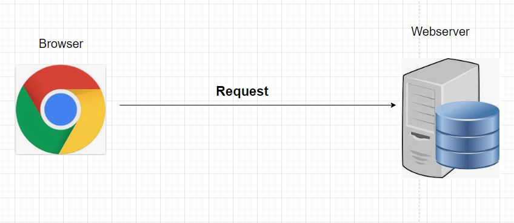
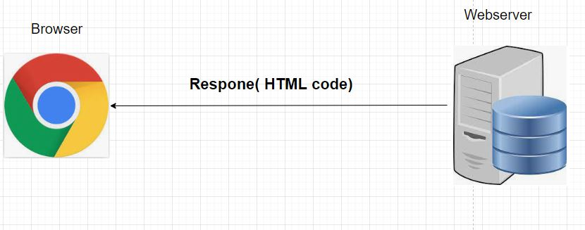
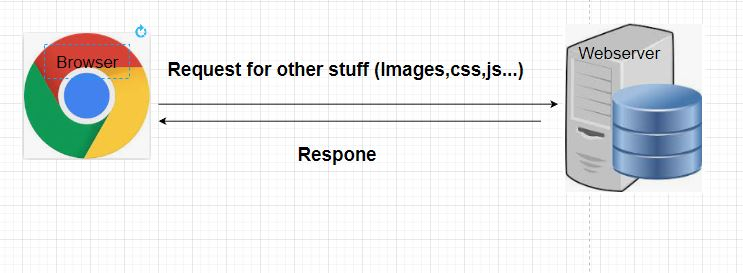
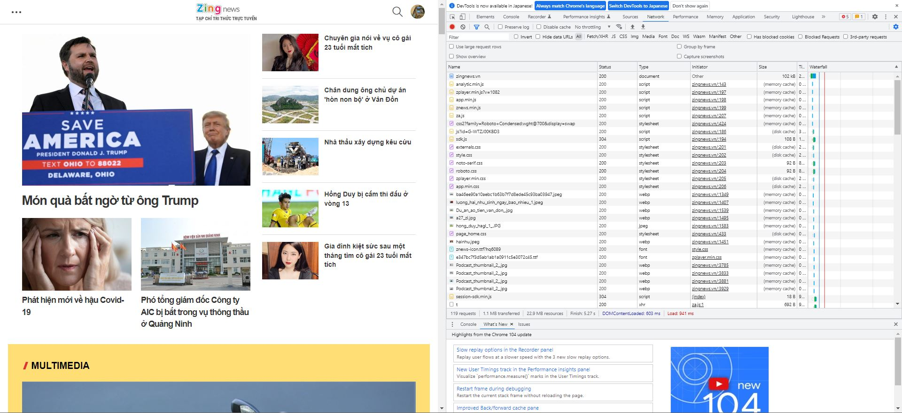

# Browser hoạt động như thế nào ?

## Step 1: Gõ zing.com.vn sau đó Enter (Gửi Request)   
  
Trình duyệt sẽ gửi 1 [Request](https://sourcedefense.com/glossary/web-request/) tới 1 [Webserver](https://developer.mozilla.org/en-US/docs/Learn/Common_questions/What_is_a_web_server)(1 phần mềm nằm trên máy chủ nào đó) thông qua giao thức HTTP, nhận request và phản hồi 1 Respone (Maby HTML code).    

## Step2: Nhận Respone từ Webserver
  

## Step3: Browser Engine đọc HTML code
  
Kiểm tra trong HTML code có những thành phần gì? link css, code javascript, ảnh, video. Nếu có Browser sẽ load các tài nguyên về và render thành 1 trang web hoàn chỉnh. Trong trường hợp bị thiếu ảnh hoặc tài nguyên thì Browser sẽ hiển thị thiếu.
## Step4: Result

Khi này kết quả đã hiển thị, sử dụng công cụ [Chrome DevTools](https://developer.chrome.com/docs/devtools/open/) thì có thể thấy zingnews.vn được respone đầu tiên 