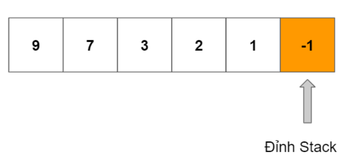

# Monotonic Stack/Deque - Ngăn xếp, hàng đợi 2 đầu đơn điệu.
- Stack hoặc deque này sẽ chứa danh sách các phần tử **luôn tăng** hoặc **luôn giảm** được gọi là stack/deque đơn điệu.     
Ví dụ cho 1 stack đơn điệu giảm 

```py
stack = [9,7,3,2,1,-1]
```
  　
<hr>
> Trước khi thêm 1 phần tử element mới vào stack, ta sẽ phải check việc thêm element này có phá vỡ điều kiện stack đơn điệu hay không? Nếu có, pop phần tử cuối ra cho tới khi nào thỏa mãn. Cuối cùng, add phần tử này vào stack. 


```py
Giải thuật
def mono_stack(arr):
    stack = []
    for element in arr:
        # Duyệt từng phần tử trong mảng arr
        # Kiểm tra việc thêm phần tử stack có làm hỏng điều kiện stack đơn điệu giảm hay không
        # Nếu có pop
        while stack and stack[-1] <= element:
            stack.pop()
            # Chúng ta sẽ viết code logic ở chỗ này. 
        
        #Nhảy ra khỏi while, lúc này có thể thêm ele vào stack 
        stack.append(element)


dry run với arr = [3,1,6,2,5,4]
1.e = arr[0] = 3 -> stack =[3]
2.e = arr[1] = 1 -> 1 bé hơn phần tử ở đỉnh stack, add 1 vào đỉnh stack -> stack =[3,1]
3.e = arr[2] = 6 -> 
        6 lớn hơn phần tử ở đỉnh stack, pop 1 ra khỏi stack ([3,1] -> [3]),
        6 tiếp tục lớn hơn phần tử ở đỉnh stack, pop 3 ra khỏi stack. stack lúc này empty, ra khỏi while
        push 6 vào stack. stack = [6].
        Ố ồ: 6 chính là next larger của 3 và 1 theo chiều từ trái sang phải. 
4. e = arr[3] = 2 -> 2 < 6 - phẩn tử ở đỉnh stack . Nếu thêm 2 vào stack thì không vi phạm tính đơn điệu. Ta thêm 2 vào stack luôn stack = [6,2]
5. e = arr[4] = 5 -> 
        5  > 2, đẩy 2 ra khỏi đỉnh stack, 2 ghi nhận 5 là phần tử lớn hơn và gần nó nhất. Đỉnh stack lúc này là 6 (stack = [6])
        5 < 6, không vi phạm. thêm 5 vào stack. (stack =[6,5])
6. e = arr[5] = 4 -> 4 < 5, không vi phạm, ta thêm 4 vào stack. stack =[6,5,4]         
```

Yeah, ngoài ra, stack đơn điệu thay vì lưu element thì có thể lưu index của element đó. Miễn sao stack maintain 1 danh sách đơn điệu là được.  


Một số bài toán liên quan có thể giải bằng Monotonic stack:         
Easy:      
[496.](https://leetcode.com/problems/next-greater-element-i/) Next Greater Element I   
[1475.](https://leetcode.com/problems/final-prices-with-a-special-discount-in-a-shop/) Final Prices With a Special Discount in a Shop     
Medium:       
[739.](https://leetcode.com/problems/daily-temperatures/) Daily Temperatures     
[503.](https://leetcode.com/problems/next-greater-element-ii/) Next Greater Element II
[907.](https://leetcode.com/problems/sum-of-subarray-minimums/) Sum of Subarray Minimums     

> Ngoài ra khi thay stack bởi deque, ta có thể  pop left phần tử  đầu tiên của deque khi gặp 1 điều kiện nào đó. Ví dụ bài [239.](https://leetcode.com/problems/sliding-window-maximum/) Sliding Window Maximum     
```py
class Solution:
    def maxSlidingWindow(self, nums: List[int], k: int) -> List[int]:
        r = []
        q = collections.deque([])
        
        
        for i in range(len(nums)):
            while q and nums[q[-1]] <= nums[i]:
                q.pop()

        
            # Chỗ code xử lý logic của chúng ta    
            q.append(i) # q thay vì chứ nums[i] thì chứa chỉ mục i
            if i>=k-1:
                if q[0]==i-k:#do phải duy trì sliding window size k, kiểm tra đoạn [q[0],i] có dài hơn k hay không
                    q.popleft() 
                r.append(nums[q[0]])


        return r
```

Nguồn:   
[VNOI](https://vnoi.info/wiki/algo%2Fdata-structures%2FStack.md?redirected_from=translate%2Fdata-structures%2FStack.md#stack-%C4%91%C6%A1n-%C4%91i%E1%BB%87u "stack đơn điệu")

[algo monster](https://algo.monster/problems/mono_stack_intro "algo monster")
[Minimum stack / Minimum queue](https://cp-algorithms.com/data_structures/stack_queue_modification.html)