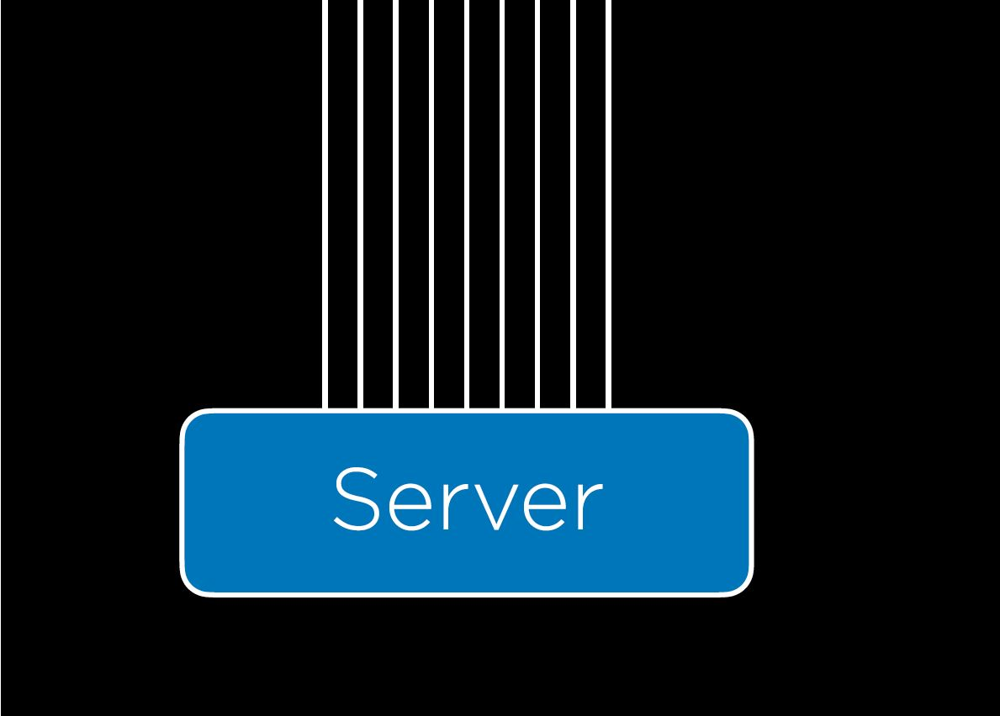
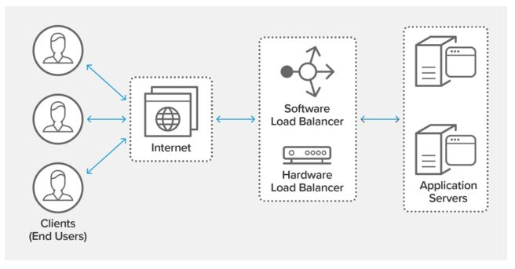
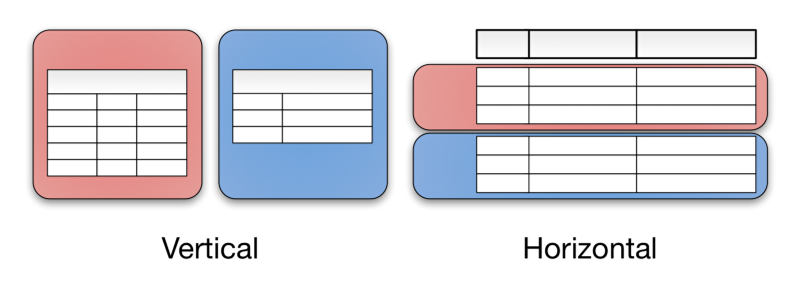
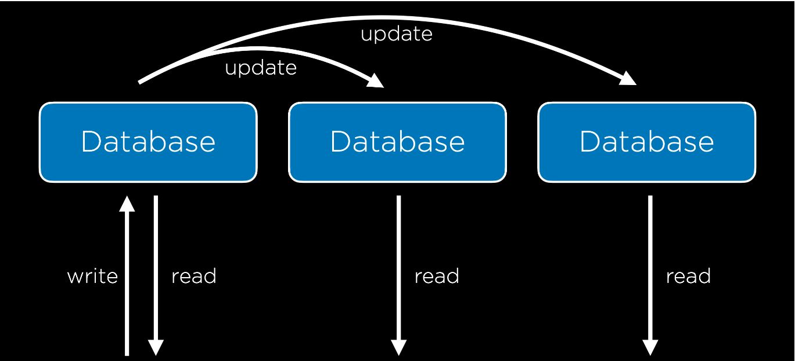
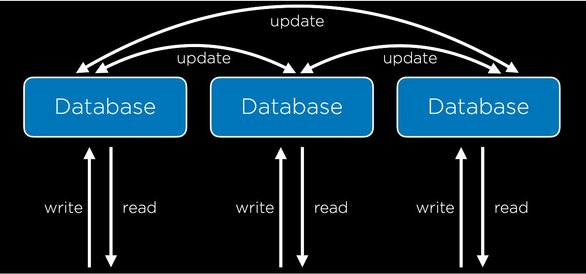
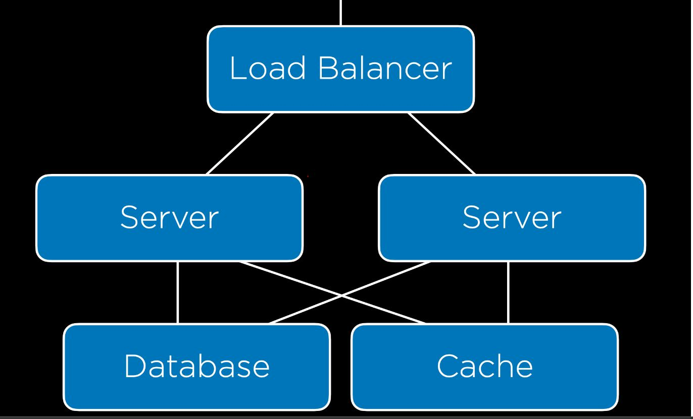

# Làm thế nào để mở rộng qui mô trang web? Ví dụ đáp ứng nhu cầu sử dụng cho khoảng vài triệu người dùng?

## Scalability

---

Sau khi viết mã cho ứng dụng web, cuối cùng thì chúng ta vẫn phải triển khai nó trên một máy chủ vật lý nào đó **servers** để mọi người từ mọi nơi có thể truy cập vào được trang web. Ngoài ra chúng ta có thể thuê máy chủ của các công ty công nghệ lớn như GG, Amazone... (hay còn gọi là dịch vụ đám mây)  

Một vài ưu và nhược điểm khi lựa chọn các phương án trên:   
* **Khả năng tùy biến**: Nếu sở hữu máy chủ riêng thì giúp khả năng tùy biến của chúng ta trở nên tốt hơn.   
* **Sự đơn giản hóa**: Chuyện sẽ trở nên đơn giản hơn rất nhiều nếu ta sử dụng dịch vụ đám mây, chúng ta không cần phải cài đặt quá nhiều.   
* **Chi phí**: Tùy vào qui mô công ty và mục đích sử dụng. Chi phí thuê dịch vụ đám mây sẽ đắt hơn sở hữu máy chủ, vì thực chất bên cung cấp dịch vụ cũng đang có những máy chủ tương tự và họ cho thuê cần phải tạo ra lợi nhuận. Tuy nhiên nếu doanh nghiệp nhỏ nếu chi phí sở hữu và maintain, thuê chuyên viên sẽ tốn kém. Không có 1 phương án tối ưu cho mọi hoàn cảnh. 
* Khả năng mở rộng **Scalability**: Mở rộng sẽ dễ dàng hơn khi sử dụng dịch vụ đám mây. 

Khi user gửi 1 request tới sever, server sẽ phải trả lại 1 response. Nhưng trên thực tế, tại 1 lúc gần như đồng thời sever sẽ phải nhận rất nhiều request cùng 1 lúc như dưới đây: 
  
---
Đây chính là vấn đề mà ta sẽ gặp phải: 
Nếu sử dụng 1 sever đơn lẻ duy nhất, sẽ có giới hạn số lượng request tối đa mà máy chủ có thể hanld được mà không làm crash phần mềm. (Có thể sử dụng **benchmarking** để kiểm tra giới hạn này) nếu lượng request vượt trên giới hạn này thì có thể có 2 cách xử lý: 
1. **Vertical Scaling**: Thay máy chủ của bạn bằng 1 máy chủ khác có cấu hình tốt hơn. Cách này có giới hạn, nếu lượng request gửi đến rất lớn thì có thể máy chủ với cấu hình tốt nhất cũng không có khả năng đáp ứng được.    
2. **Horizontal Scaling**: Sử dụng thêm nhiều máy chủ nữa để chia ra handle các request.   

## Load Balancing   

Khi sử dụng phương pháp thứ 2, sẽ có vấn đề phát sinh là: **Ta phân chia nhiệm vụ xử lý các request như nào?**. Câu trả lời ở đây là sử dụng [Load Balancer](https://www.nginx.com/resources/glossary/load-balancing/). Một thiết bị phần cứng có trách nhiệm tiếp nhận các imcoming requests và phân phối các request này đến các sever.
   

Có một vài cách để Load balancer phân chia nhiệm request tới các server:
* **Random**: LB sẽ chọn ngẫu nhiên một server để xử lý 1 request tới.
* **Round-Robin**: Chia đều mỗi request tới cho mỗi server theo thứ tự và quay vòng. Ví dụ có 3 server: A,B,C. Request 1, A xử lý. 2, B xử lý. 3, C xử lý và 4 lại là A xử lý.   
* **Fewest Connection**: LB sẽ tìm kiếm server nào hiện tại đang có ít request đang xử lý nhất và chỉ định server đó xử lý request. (Nghe kiểu giống heap quá.) Như vậy sẽ mất thời gian để LB tính toán tìm ra server nào.   
Đọc đến đây tôi cảm thấy LB cứ như cô giáo, và mỗi học sinh là 1 sever tương ứng request ở đây là gọi trả bài. Cô có thể chọn ngẫu nhiên(**Robin**), chọn để thằng nào cũng phải lên bảng số lần như nhau(**round-robin**), hoặc chọn thằng nào ít được lên bảng nhất.(**Fewest**) :))   

Không có phương án nào tốt nhất ở mọi hoàn cảnh. Tùy hoàn cảnh mà chọn phương pháp!   
-------
Một vấn đề nữa đó chính là **session**. Khi user gửi request, LB sẽ chỉ định 1 server(tạm gọi là sever A) nào đó để handle request này, session này được lưu trữ ở server A, nhưng user đó lại gửi 1 request mới, mà không muốn phải nhập lại thông tin trong trường hợp LB giao rq này cho sever khác không phải A???? Dưới đây là 1 số giải pháp:     
1. **Sticky Sessions**: Khi user truy cập vào 1 trang, LB sẽ nhớ sever nào xử lý user này. Lần tới khi user truy cập lại, LB sẽ tìm đúng sever đã xử lý cho user đó. Một vấn đề có thể gặp phải là có quá nhiều user cùng đc xử lý tại 1 sever -> Sever có thể bị crash.   
2. **Database Sessions**':Sessions sẽ được lưu ở database.  Ok, LB cứ gửi ngẫu nhiên xuống cho các sever mà không cần quan tâm sever nào làm việc với user trước đó. 1 vấn đề mà ta có thể gặp phải là tốn thời gian để tính toán đọc, ghi dữ liệu.
3. **Client-Side Sessions**: Thay vì lưu thông tin session ở phía sever. Ta lưu thông tin ở phía client thông qua cookie.  

-------


## Autoscaling   
Là việc tăng, giảm số lượng server để phục vụ các request. 
### Sever failure.   
#### Single Point Failure 
Là việc mà chỉ vì một phần cứng bị hỏng dẫn tới hoảng toàn bộ hệ thống. Ví dụ nếu scaling theo Vertical- thay server có cấu hình tốt hơn. Thế nhưng khi server crash thì có thể ngưng toàn bộ hệ thống. Ngược lại Horizontal Scaling nếu 1 sever hỏng thì vẫn còn các sever còn lại đón nhận request từ LB. Ngoài ra LB có thể phát hiện server nào bị hỏng thông qua việc nhận tín hiệu **heartbeat** từ server.    

------


## Scaling Database

Ngoài việc mở rộng qui mô máy chủ để sử lý các request đến, ta cũng cần mở rộng cơ sở dữ liệu. Khi lượng record, table trở lên lớn theo thời gian, hoặc chúng ta muốn chứa được nhiều dữ liệu hơn lưu trữ không chỉ trên 1 máy chủ mà có thể trên các máy chủ khác. Khi này lại có thể phát sinh thêm nhiều vấn đề như: Database của chúng ta không thể xử lý tất cả các request được gửi đến.   
#### 1.Vertical Partition: Chia dữ liệu thành nhiều bảng con hơn là sử dụng một bảng to mà chứa nhiều trường thông tin không cần thiết.   
#### 2.Horizontal Partition: Sử dụng thêm nhiều bảng tương tự với cùng kiểu dữ liệu nhưng khác nhau về thông tin. Việc tìm kiếm thông tin lúc này có thể sẽ dễ dàng hơn.  
Ví dụ về Horizontal Partition: Bảng dữ liệu học sinh của toàn quốc thì ta có thể chia ra thành 2 hoặc nhiều hơn theo vùng miền. Như vậy khi tìm kiếm 1 học sinh, thay vì phải duyệt toàn bộ học sinh cả nước, ta tìm bảng học sinh đó ở vùng miền nào rồi tìm kiếm bảng đó. -> Tiết kiệm thời gian hơn. 

   
---

## Database Replication 
Ngay khi ta scale database thì ta vẫn có thể gặp phải vấn đề **Single Point Failure**. Nếu database của chúng ta crash, có thể ta sẽ bị mất toàn bộ dữ liệu. Nếu ta thêm nhiều máy chủ, mỗi máy chủ lại chứa 1 database là bản sao của database gốc, điều này sẽ giúp ta tránh được vấn đề **Single Point Failure** khi một trong số các host server bị vấn đề.  
Có nhiều cách triển khai **Database Replication** chẳng hạn như: 

1. Single-Primary Replication: Có nhiều cơ sở dữ liệu, nhưng chỉ 1 trong số chúng là primary database - nghĩa là bạn có thể read, write vào database này. Còn các database khác chỉ phục vụ cho thao tác truy xuất. Khi primary database đươc ghi, các database còn lại cũng được update để đồng bộ hóa thông tin sao cho giống database chính. (Vấn đề lúc này có thể là latency-độ trễ, gửi dữ liệu chưa được update tới client.....). Nhưng cách này vẫn chưa thực sự giải quyết triệt để **Single Point Failure**: một máy chủ chứa database chính, vì 1 lý do nào đó máy chủ này crash, toàn bộ data ở primary database này biến mất, chúng ta vẫn bị mất thông tin do các DB kia chỉ là bản sao.     
   
---


2. Multi-Primary Replication: Tất cả các database đều được đọc và ghi, nó giải quyết vấn đề SPF nhưng lại rối rắm ở việc đồng bộ hóa. Sẽ có các xung đột có thể xảy ra: 
    * Update Conflict
    * Uniqueness Conflict(2 row cùng index nhưng data khác nhau)
    * Delete Conflict(Một user xóa 1 hàng trong khi user khác lại update hàng đó?)....   



## Caching 
Khi hệ thống trở nên to và rộng, database chứa rất nhiều dữ liệu. Việc truy xuất dữ liệu từ database lúc này sẽ tốn kém. Việc giảm thiểu truy xuât tới database càng nhiều càng tốt. Nếu những dữ liệu được truy xuất với tần số lớn, ta có thể lưu nó dưới bộ nhớ tạm. Đây là ý tưởng của CACHING- lưu trữ những thông tin thường xuyên được sử dụng để khỏi phải mất công truy xuất tới database.    
Caching có thể được triển khai bằng cách lưu giữ dữ liệu ở phía user, khi user reload lại trang web,không request nào cần send tới host. 
Ví dụ khi HTTP response trả về có chứa thông tin như này    
```
Cache-Control: max-age=86400
```  
Thì tức là host đang nói với browser rằng, trong 86400 miliseconds kể từ lúc tôi đóng trình duyệt, nếu tôi mở trang web lên lại thì không request nào phải gửi tới sever, thay vào đó sẽ load lại web từ cache.

Đó là caching ở phía client. Caching cũng thường xuyên được sử dụng ở phía server. Lúc này phía backend set up sẽ trông giống kiểu như này. Tất cả các server đều tương tác với cache
---
   
---


