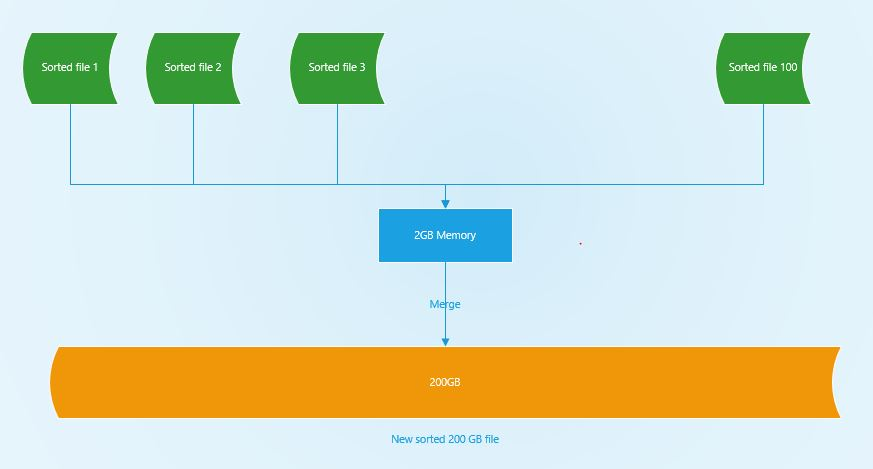

## Question: Imagine you have a 200 GB file on disk, with **one string per line**. Explain how you would sort the file with **only 2 GB** RAM machine.

### Some observations:
1. It is impossible to load the whole file on disk into RAM (200GB >> 2GB)
2. We must feed something into RAM that it's size less or equal than RAM size

### Algorithms:
1. Open the 200GB file
2. Read 2GB of the data in main memory and sorted it by QuickSort 
3. Write the sorted data in new file (to disk)
4. Repeat step 2 & 3 until read out of the resource file which is we have 200/2 = 100 sorted files in disk now
5. Create new file ,therefore we merge all sorted files into new file. Done!

### More specifix

Open big file, read chunks of data and sorted, therefore write it on disk. loop until we read out of big file

Merge these chunks file.

Let size of big file is N and size of RAM is M
At step 5. We open all [N/M] (says K )sorted file and create template array of K smallest elements from K files and we also have to remember which files that smallest elements belong in and which is the index of that element in file
Each time we find the smallest element of array K, we append that element into new file,at the end.
Put new element from file where previous smallest element belong into template array
Merge part will finish when all the indexes reach to the end of every files.

### Psuedo code
#M is size of ram, N is size of big file
open big file
cnt = 0
while not read out of big file:
    read M GB of data into RAM
    sort 
    write to file cnt.txt
    cnt+=1
close big file
open all sorted files and let file_i_th point to file i'th
tmp_arr = [(ele1,file1),(ele2,file2),(el3,file3),....(elek,filek)]
new_file = create new file and open it
while len(tmp_arr)>0:
    ele,FILE = find_smallest_element(tmp,arr)
    append(ele,new file)
    if is_end_file(FILE) is false:
        tmp_arr.append((new_ele,FILE))

close files

### Complexity analystic:
Read big file take O(N) , sort and write each chunk take O(MlogM+M) => Total running time: O(K*M log M ) = O(NlogM) 
At step of merging files. Running time depends of find_smallest_element function. 
Normally using iterative will take O(K) to find the smallest. Total running time of this step will be O(N*K)
If we using heap, find the smallest take O(logK). Total running time of this step will be O(N*logK)

=> Total running time of process: O (N*(logM+logK))

